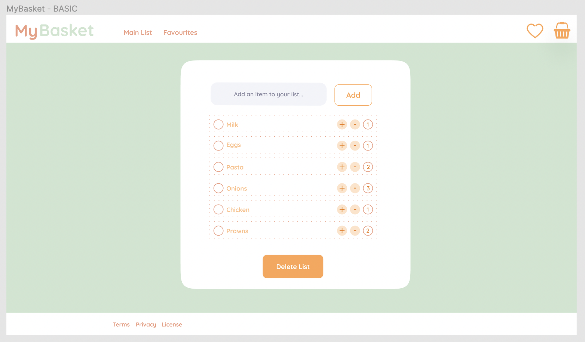
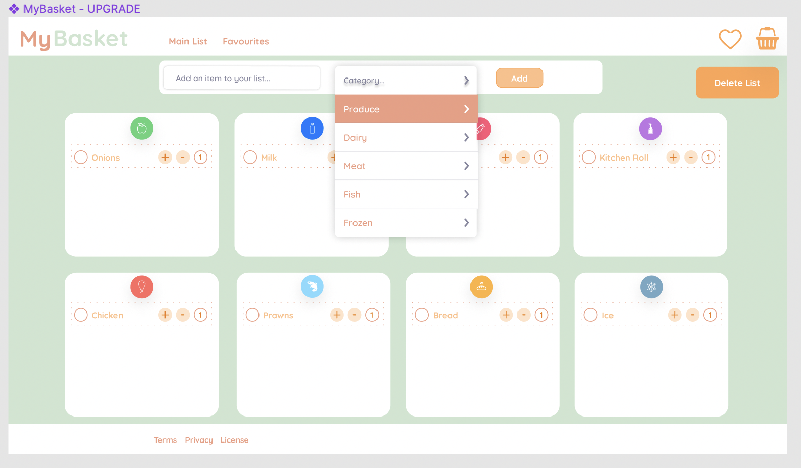
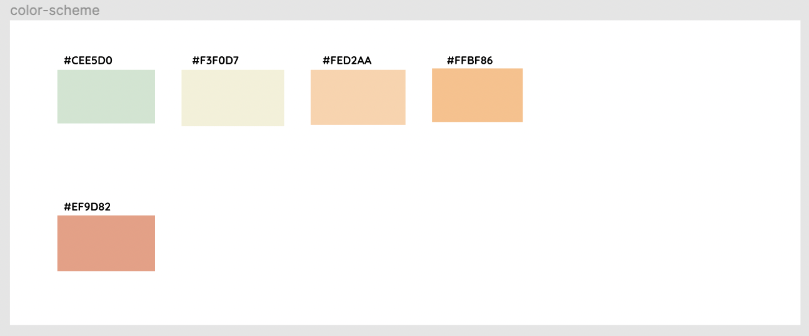

# MyBasket

Language: Ruby-on-Rails

Function: Shopping Basket

This app works as a shopping list, which has the following features:
* Google sign-in prompt
* Add an item to your list
* Edit an item on your list
* Delete an individual item on your list
* Delete the entire list
---

## Figma
### Basic

### Upgrade

### Colour Palette

